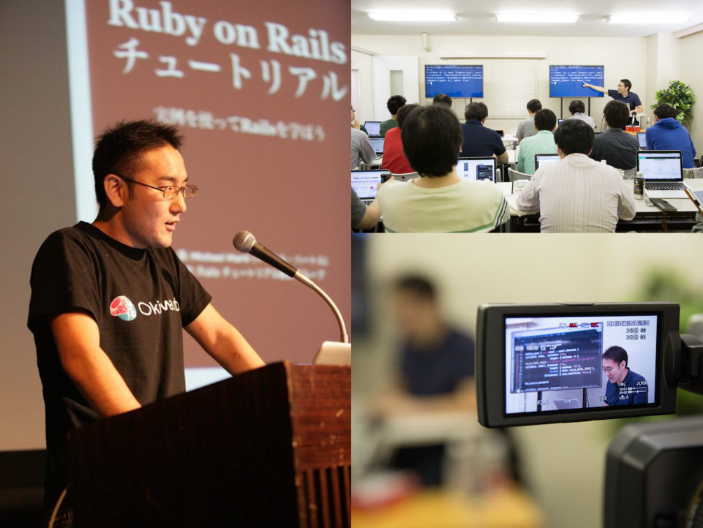
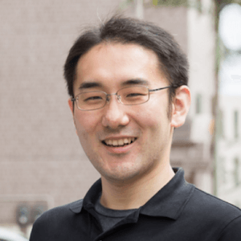

  <iframe src="https://www.youtube.com/embed/oo1dVd_sNwA?rel=0&autoplay=1&showinfo=0&controls=0&fs=0&modestbranding=0" frameborder="0" allow="autoplay; encrypted-media" allowfullscreen></iframe>

<section class="entry_content pt-5 mb-5">
  

    

      

        <h1>YassLab 社のやること</h1> 

        

          YassLab 社ではオープンソースやそのコミュニティと共に活きるビジネスに挑戦しています。価値と対価を交換するビジネスの難しさを認識しつつも、軸足を還元に置いた働き方を大切にしています。

        

          <a href="https://railstutorial.jp/" target="_blank">Railsチュートリアル</a>や<a href="https://railsguides.jp/" target="_blank">Railsガイド</a>はその一例です。
	  これらのサイトは YassLab 社のみで出来上がったものではなく、原著者や翻訳協力者を含め、様々な関係者がいます。
	  各関係者やコミュニティへの価値の還元を前提としつつ、その中で実現可能なビジネスに YassLab 社は挑戦します。
	  例えば <a href="https://creativecommons.org/licenses/by-sa/4.0/deed.ja">CC BY-SA</a> で公開されているRailsガイドであればそのライセンスにしたがって実現できるビジネスを模索し、Railsチュートリアルのような著作物であれば<a href="https://railstutorial.jp/#foreword">原著者の許諾</a>のもと実現できるビジネスを実践します。

        
このような関係者への感謝と還元が第一にあり、その上で実現可能なビジネスに挑戦するチームが YassLab 社です。

        
	
        <h2 class="text-center mb-5" id="culture">YassLab 社の文化</h2>
        
YassLab 社ではコミュニティと共に成長できる継続的なカタチを大切にします。コミュニティから得た価値を享受するだけのやり方は好みではありませんし、一方で、コミュニティが成長するために自分たちの時間や資産を無尽蔵に提供することが継続的なカタチに繋がるとも思えません。YassLab 社では互いに可能な範囲で協力しつつ、かつ、互いにとってメリットのあるカタチを大切にします。

        
CoderDojo Japan への開発支援はうまく回っているカタチの1つです。<a href="/ja/agile">YassLab 社の開発支援サービス</a>は有償ですが、CoderDojo Japan への開発支援は互いに価値を提供し合えるため無償で行なっています。

	
        <ol>
          <li>CoderDojo Japan: <a href="https://coderdojo.jp/kata">道場情報</a>や<a href="https://coderdojo.jp/stats">統計情報</a>など、Webサービスを通してコミュニティに価値を提供</li>
          <li>YassLab: <a href="/ja/join-forces/#flow">採用フローの一環</a>として、オープンかつ実践的な場で互いの文化を確認する機会を提供</li>
        </ol>
	
        
例えば CoderDojo の統計情報ページは、CoderDojo コミュニティへの支援を検討する企業や<a href="https://www.facebook.com/groups/coderdojo.jp/permalink/1651340498312676/">メディアの情報源として活用</a>され、弊社にとっては応募者と一緒に<a href="/ja/join-forces/#flow">実践的な開発をするオープンな場</a>にもなっています。

	
        
チームとして掲げている「Having a Good Life with OpenSource ;)」というフレーズは、こういったコミュニティと会社が一緒に成長できる継続的なカタチを表した言葉です。

        
コミュニティを Hub として様々な人達と繋がりながら、弊社自身も社会の大切な仕組みの１つになりたいと考えています。

      

      

	<h2 class="text-center mb-5">代表者 プロフィール</h2>
        

          
        

        
YassLab (株) 代表取締役

        <h4 class="text-center mb-3 h3deco-none">安川 要平</h4>
        <ul class="profile__sns mb-3">
          <li class="profile__sns__icon">
            
          </li>
          <li class="profile__sns__icon">
            
          </li>
          <li class="profile__sns__icon">
            
          </li>
          <li class="profile__sns__icon">
            
          </li>
	  <li class="profile__sns__icon">
	    
	  </li>
        </ul>
      

    

    

      

        

	  
早稲田大学情報理工学科卒 (修士)。米国留学中に<a href="https://play.google.com/store/apps/details?id=org.sorarier.whistle">震災対策アプリ</a>を開発し、震災の翌日に公開。そのアプリのヒットを契機に、帰国後、沖縄と東京を軸とした会社「YassLab」を起業。主に<a href="/ja/agile">月額制の Ruby/Rails 開発支援</a>、教材制作・ライセンス販売、継続的翻訳・組版技術研究の３つの事業を展開。

	  
2012年にGoogle所属 (当時) のPMに推薦され<a href="https://www.ipa.go.jp/jinzai/mitou/kinkyou/creator.html">IPA未踏スーパークリエータ</a>に認定。沖縄で行われた週末ものづくり講座が高く評価され、2013年に<a href="http://www.tedxryukyu.com/">TEDxRyukyu</a>に登壇。2014年に<a href="http://railstutorial.jp/">Railsチュートリアル</a>の功績が評価され、フクオカRuby大賞にて優秀賞を受賞。2015年より<a href="http://jr.mitou.org/">未踏ジュニア</a>の立ち上げに参画し、PMとして活躍。国際的な子ども向けプログラミングクラブ「CoderDojo」の <a href="http://kata.coderdojo.com/wiki/CoderDojo_Community_Committee">Community Committee</a> に就任し、2016年からは<a href="https://coderdojo.jp/">一般社団法人 CoderDojo Japan</a> の代表理事に就く。現在は<a href="https://speakerdeck.com/yasulab/continuous-integration-for-ebook">継続的翻訳・組版システム</a>を開発しながら<a href="https://railsguides.jp/">Railsガイド</a>等の大型書籍制作の自動化に挑戦している。

        

      

    

    
    

      <iframe width="560" height="315" src="https://www.youtube.com/embed/mzOc4iUZtuE?rel=0" frameborder="0" allow="autoplay; encrypted-media" allowfullscreen></iframe>
    

      

    

      

        

          <h1 class="text-center mt-5 mb-5">会社概要</h1>
        

        <table class="about-table">
          <tbody>
            <tr>
              <th>会社名</th>
              <td>{{ site.company.name }} 株式会社</td>
            </tr>
            <tr>
              <th>社員数</th>
              <td>{{ site.company.size }}名 (パート・<a href="/ja/join-forces">複業採用</a>含む)</td>
            </tr>
	    <tr>
              <th>資本金</th>
              <td>{{ site.company.capital }}万円</td>
            </tr>
            <tr>
              <th>創業日</th>
              <td>2012年6月1日 (2018年1月11日 法人成り)</td>
            </tr>
	    <tr>
              <th>所在地</th>
              <td>〒169-0075 東京都新宿区高田馬場1-28-10 三慶ビル4階 CASE Shinjuku</td>
            </tr>
            <tr>
              <th>商標登録</th>
              <td><a href="https://www.j-platpat.inpit.go.jp/web/TR/JPT_5982564/A6156E75F65DAF34797EEE3AEF4EB33C">商標公報5982564</a></td>
            </tr>
            <tr>
              <th>顧問社労士</th>
              <td> <a href="https://oka-sr.jp/">社会保険労務士法人 岡佳伸事務所</a> 岡 佳伸</td>
            </tr>
            <tr>
              <th>顧問税理士</th>
              <td> <a href="http://www.hay-kaikei.com/">Hay未来の税理士法人</a> 林 寛之</td>
            </tr>
            <tr>
              <th>顧問弁護士</th>
              <td>新都心法律事務所 野島 梨恵"> <a href="http://nojimarie.naganoblog.jp/">新都心法律事務所</a> 野島 梨恵</td>
            </tr>
            <tr>
              <th>関連団体</th>
              <td>
                BOSS-CON JAPAN (Rails認定ゴールドインテグレーター) 
                Rails技術者認定試験運営委員会 (テクニカルアドバイザー) 
                OSS Gate (Doorkeeper スポンサー) 
                RyukyuFrogs (テクニカルサポーター・協賛) 
                RubyKaigi (翻訳協力) 
                Scrivito (開発協力) 
                CoderDojo Japan (開発支援) 
                Mitou Foundation (未踏ジュニアPM・教材スポンサー)
              </td>
            </tr>
          </tbody>
        </table>

      

    

  

</section>
