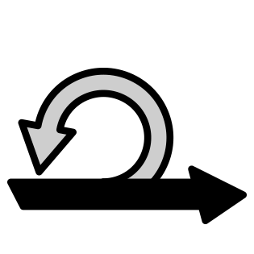
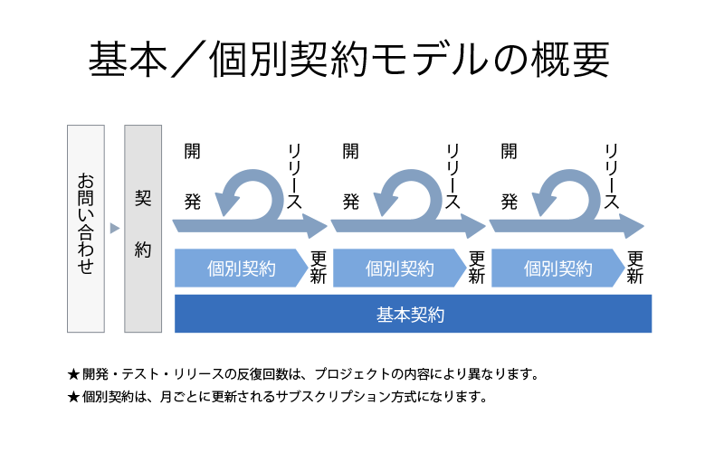

<section class="pageVisual">
  

  

</section>

<section class="entry_content pt-5">
  

    

      

        

          <h1 class="mb-5">月額制の Ruby/Rails 開発支援</h1>
		  <h3 class="mb-5">経験豊富なチームで 御社の開発をサポートします</h3>
        

		
      
<!--//col-->
    
<!--//row-->
  
<!--//container-->
  
 

</section>

<section class="entry_content pt-5">
  
         
    

      

        <h2 class="mb-5"><a href="#skills">得意なスキル・サービス</a></h2>
      

      
      

	     
        Ruby / Rails
      
 <!--//col-->
      
      

         Test
      
  <!--//col--> 
      
      

         Git / GitHub
      
  <!--//col--> 
            
      

 

      

         Heroku / AWS
      
 <!--//col-->
        
	  

         Continuous Integration
      
  <!--//col--> 
        
	  

         Agile Web Development
      
  <!--//col-->  
            
      

        
上記の他、フロントエンドの技術 (HTML, CSS, JavaScript, jQuery, Vue.js) なども扱えますが、フロントエンドのみの開発支援は行っておりません。ご注意ください。

      

                
    
<!--//row-->
  
<!--//container-->
</section>

<section class="entry_content pt-5 bg-gray">
  

    

      

        <h2 class="mb-5"><a href="#style">契約スタイル</a></h2>
        
弊社では、IPAが公開しているアジャイル開発向けのモデル契約 (基本 + 個別契約) をベースにしております。

                 
        

	      
	        
          
参考: <a href="https://www.ipa.go.jp/files/000005404.pdf">アジャイル開発向けモデル契約案について</a> (IPA)

	    

          
        
この契約の特徴は次の通りです:

        <ul>
          <li>基本契約でNDAや著作権の譲渡などを取り扱います</li>
          <li>準委任契約となり、成果物は作業報告書になります</li>
        </ul>
		
上記のモデル契約書を具体化した契約書が、次の契約書になります。特に、ユーザとベンダの定義、個別契約書と作業報告書の関係性などを具体化しています。

          
        
<a href="https://www.dropbox.com/sh/zqrdkmie0dambh1/AAD8ilSwPIBzrT09qu_9f4B3a" target="_blank">IPAのモデル契約をベースにした基本/個別契約書の例 (作成: YassLab 株式会社)</a>

          
        
なお、本契約スタイルと似た契約であれば、上記の契約書でなくても問題ありません。

      
<!--//col-->
    
<!--//row-->
  
<!--//container-->
</section>

<section class="entry_content pt-5">
  

    

      

        <h2 class="mb-5"><a href="#price">基本料金: 100万/月〜</a></h2>
        <ul>
          <li>基本料金は週30〜40時間相当の稼働に対する金額となります</li>
      	  <li>安定的に価値を出すため、基本的に２名以上のチームで対応します</li>
          <li>これまでの事例では、常時２〜３名の稼働による開発支援が多いです</li>
        </ul>
      
<!--//col-->
    
<!--//row-->
  
<!--//container-->
  

</section>

<section class="entry_content pt-5 pb-5">
  

    

      

        <h2 class="mb-5"><a href="#schedule">現在のスケジュール</a></h2>
        <table class="month-sche">
          <tr>
            <th>11月</th>
            <th>12月</th>
            <th>1月</th>
            <th>2月</th>
            <th>3月</th>
            <th>4月</th>
          </tr>
          <tr>
            <td> </td>
            <td> </td>
            <td> </td>
            <td> </td>
            <td> </td>
            <td> </td>
          </tr>
        </table>
		 
		<ul style="list-style: none;">
          <li>
		  　現在ご対応が可能です。ご相談お待ちしております。</li>
          <li>
		  　各社と予定調整中です。まだ間に合いますので、まずはお問い合わせください。</li>
          <li>
		  　契約が締結されました。様々なお問い合わせ、ありがとうございました。</li>
        </ul>
		  
      
<!--//col-->
    
<!--//row-->
  
<!--//container-->
  

</section>

<section class="entry_content pt-5 pb-5 frequently-asked-questions">
  

    

      

        <h2 class="mb-5"><a href="#faq">よくある質問</a></h2>
        <dl class="faq">
          <dt>１ヶ月だけの個別契約も可能ですか？</dt>
          <dd>はい、可能です。ただし翌月以降の契約の更新は保証されません。 一定期間の継続した開発支援をご希望の場合は、２〜６ヶ月単位でお申し込みください。まずは１ヶ月のみ、その後に３ヶ月または６ヶ月単位で更新していく事例が多いです。</dd>
		    
		  
		  <dt>対応可能な時間帯は決まっていますか？</dt>
		  <dd>基本的には 10:00〜19:00 としております (休憩１時間、打ち合わせや作業報告書の作成時間なども含まれます)。朝会がこの時間帯より早く始まるなどの理由で、対応時間を変更したい場合はお問い合わせください。</dd>
		    
		  
		  <dt>弊社のオフィスに常駐できますか？</dt>
		  <dd>オンラインでの開発支援を基本としており、オフィス常駐は行っておりません。代わりに、定期的なオンラインミーティングを推奨しております。東京近辺であれば、具体的な進め方をご説明しに伺うことも可能です。</dd>
        </dl>
      
<!--//col-->
    
<!--//row-->
  
<!--//container-->
  

</section>

<section class="entry_content pt-5 catchCopy">
  

    

      

        <h2 class="text-center mb-5"><a href="#clients">これまでの取引先</a></h2>
        <ul>
          <li>国内
          <ul>
          <li><a href="http://agile.esm.co.jp/">永和システムマネジメント アジャイル事業部</a> (開発パートナー)</li>
          <li><a href="http://www.recruit-mp.co.jp/">リクルートマーケティングパートナーズ</a></li>
          <li><a href="https://mtl.recruit.co.jp/">リクルートホールディングス (Media Technology Lab)</a></li>
          <li><a href="http://www.nttr.co.jp/">NTTレゾナント</a></li>
          <li><a href="http://speee.jp/">Speee</a></li>
          <li><a href="https://www.freee.co.jp/">freee</a></li>
          </ul>
          </li>
		  
          <li>海外
          <ul>
          <li><a href="https://www.railstutorial.org/">Ruby on Rails Tutorial by Michael Hartl</a> (米国)</li>
          <li><a href="https://www.learnenough.com/">Learn Enough to Be Dangerous</a> (米国)</li>
          <li><a href="https://scrivito.com/partners">Scrivito: The Professional Cloud-Based Rails CMS</a> (ドイツ)</li>
          <li><a href="https://tickleapp.com/ambassador/">Tickle: Programming re-imagined for the connected world</a> (台湾)</li>
          </ul>
          </li>
        </ul>
        
        
より詳しい実績については、<a href="/ja/works/">事業実績ページ</a>をご参照ください。

      
<!--//col-->
    
<!--//row-->
  
<!--//container-->
  

</section>

<section class="entry_content pt-5">
  

    

      

        <h2 class="text-center mb-5"><a href="#references">他、参考情報</a></h2>
        <ul>
          <li>会社名: YassLab 株式会社</li>
          <li>社員数: 12人 (パート・複業採用含む)</li>
		  <li>資本金: 500万円</li>
          <li>創業日: 2012年6月1日 (2018年1月11日 法人成り)</li>
          <li>代表取締役: 安川 要平</li>
          <li>顧問社労士: <a href="https://oka-sr.jp/">社会保険労務士法人 岡佳伸事務所</a> 岡 佳伸</li>
          <li>顧問税理士: <a href="http://www.hay-kaikei.com/">Hay未来の税理士法人</a> 林 寛之</li>
          <li>顧問弁護士: <a href="http://nojimarie.naganoblog.jp/">新都心法律事務所</a> 野島 梨恵</li>
          <li>パートナー・関連団体:
          <ul>
            <li><a href="http://www.boss-con.jp/railspartner/">BOSS-CON JAPAN</a> (Rails認定ゴールドインテグレーター)</li>
            <li><a href="http://www.railscp.com/aboutus/">Rails技術者認定試験運営委員会</a> (テクニカルアドバイザー)</li>
            <li><a href="https://oss-gate.github.io/">OSS Gate</a> (<a href="/ja/doorkeeper">Doorkeeper スポンサー</a>)</li>
            <li><a href="http://www.ryukyu-frogs.com/">RyukyuFrogs</a> (テクニカルサポーター・協賛)</li>
            <li><a href="http://rubykaigi.org/">RubyKaigi</a> (翻訳協力・スポンサー)</li>
            <li><a href="https://scrivito.com/partners">Scrivito</a> (開発協力パートナー)</li>
            <li><a href="https://coderdojo.jp/">CoderDojo Japan</a> (<a href="https://yasslab.jp/ja/posts/coderdojo-japan-2018">開発支援パートナー</a>)</li>
            <li><a href="http://www.mitou.org/">Mitou Foundation</a> (<a href="http://jr.mitou.org/">未踏ジュニア</a>PM・スポンサー)</li>
          </ul>
        </li>
		
        <li>SNS: 
		  <a href="https://github.com/yasslab">GitHub</a> (<a href="https://github.com/search?utf8=%E2%9C%93&amp;q=user%3Ayasslab+fork%3Atrue&amp;type=Repositories&amp;ref=searchresults">人気順</a>), 
		  <a href="http://qiita.com/organizations/yasslab">Qiita</a>, 
		  <a href="https://www.facebook.com/yasslab.jp">Facebook</a>, 
		  <a href="https://twitter.com/YassLab">Twitter</a>, 
		  <a href="https://www.youtube.com/c/YassLab">YouTube</a>, 
		  <a href="https://www.wantedly.com/companies/YassLab">Wantedly</a>.</li>
        <li>自社運営サービス:
		  <ul>
            <li><a href="https://railstutorial.jp/">Ruby on Rails チュートリアル</a></li>
            <li><a href="http://railsguides.jp/">Ruby on Rails ガイド</a> (<a href="https://github.com/yasslab/railsguides.jp">GitHub</a>)</li>
            <li><a href="https://coderdojo.jp/">CoderDojo Japan</a> (<a href="https://github.com/coderdojo-japan/coderdojo.jp">GitHub</a>)</li>
		  </ul>
		</li>
	  </ul>

      
<!--//col-->
    
<!--//row-->
  
<!--//container-->
</section>
