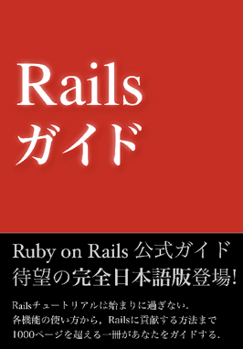
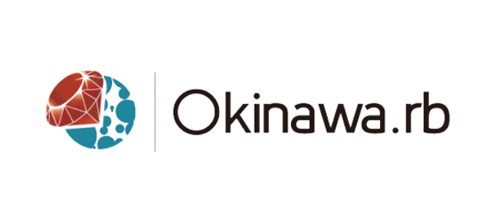
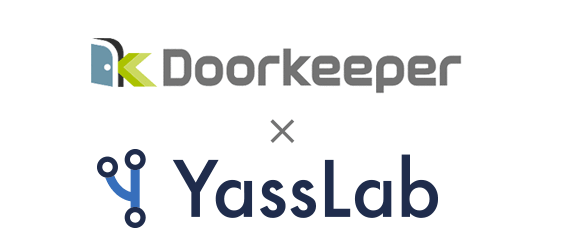

<section class="mainVisual">
  

    
    
    <picture>
    	<source media="(min-width: 600px)" srcset="../img/top-image-large.jpg">
    	
    </picture>
    
    <!--h1 class="display-4 text-center"-->
      

        
        <h1>Having a Good Life with OpenSource ;)</h1>
      
<!--//logo-catch-->
  

</section>
<section class="catchCopy entry_content" id="vision">
  

    

      

        <h2>新しいサービスを、Ruby で</h2>
        
オープンソースソフトウェアやコミュニティへの還元を大切にしつつ、 事業としても共に成長できる、そんなビジネスに関わり続けている会社です。

      

    

  

</section>
<section class="service entry_content" id="products">
  

    

      

        <h3 style="line-height: 2.0em;">《継続的翻訳/組版システム》 
		Web 開発の学びを Ruby で支える</h3>

        

          

            
            <a href="https://railstutorial.jp/" target="_blank">
              <button class="btn btn-ruby">初級・中級者向け</button>
            </a>
            <a href="https://railstutorial.jp/" target="_blank"><h4>Railsチュートリアル</h4></a>
            
SNS の開発を題材にした大型チュートリアル。Web サービスの開発から公開までの流れを実例を通して学べます。解説動画や質問対応サービスも提供。

          

          

            
            <a href="https://railsguides.jp/" target="_blank">
              <button class="btn btn-ruby">上級者向け</button>
            </a>
            <a href="https://railsguides.jp/" target="_blank"><h4>Railsガイド</h4></a>
            
Ruby on Rails 公式の大型リファレンスガイド。Rails の各機能を体系的に学び、Web 開発の生産性を高めたいときに。検索可能な電子書籍版も提供。

          

        

      

    

  

</section>
<section class="developmentSupport entry_content">
  

    

      

        <h3 style="line-height: 2.0em;">《月額制の Ruby/Rails 開発支援》 
		開発事業を月単位でサポートします</h3>
        

          

            <figure id="ruby">
              
               <figcaption>Ruby / Rails</figcaption>
            </figure>
          

          

            <figure id="cloud">
              
              <figcaption>Heroku / AWS</figcaption>
            </figure>
          

          

            <figure id="agile">
              
              <figcaption>Agile Web Development</figcaption>
            </figure>
          

        
<!--//row-->
      
<!--//col-->
    
<!--//row-->

   

      

        

            <a href="/ja/agile" class="btn btn-primary btn-block mt-2">詳細を見る</a>
          

        
<!--//col-->
        

        

            <a href="/ja/works" class="btn btn-primary btn-block mt-2">過去の実績を見る</a>
          

        
<!--//col-->
    
<!--//row-->

  
<!--//container-->
</section>
<section class="aboutVisual entry_content" id="remote">
  

    

      

        <h2>沖縄
		×
		東京</h2>
        
YassLab 社は技術で勝負したいソフトウェアエンジニアのリモートチームです。 フルタイム・パートタイム・複業、様々な関わり方があります。

        

            <a href="/ja/join-forces" class="btn btn-primary">採用情報</a>
          

      
<!--//col-->
    
<!--//row-->
  
<!--//container-->
</section>
<section class="okinawaMember">
  

    

      

        <h3>沖縄メンバー</h3>
        

          
	  
	  
	  {% include member.html username='AnaTofuZ'   caption='Perlが好きなエンジニア。<a href="https://ie.u-ryukyu.ac.jp/%E5%AD%A6%E7%A7%91%E7%B4%B9%E4%BB%8B/%E7%A0%94%E7%A9%B6%E5%AE%A4%E7%B4%B9%E4%BB%8B/%E4%B8%A6%E5%88%97%E7%A0%94%E7%A9%B6%E5%AE%A4%EF%BC%88%E6%B2%B3%E9%87%8E%E7%A0%94%EF%BC%89/">並列研 (河野研)</a>' %}
	  
	  
        

      

    

  

</section>
<section class="tokyoMember">
  

    

      

        <h3 class="mt-5">東京メンバー</h3>
        

	  
	  
	  
	  
        

        

          <a href="/ja/about">
            <button class="btn btn-primary">会社概要を見る</button>
          </a>
        

      

    

  

</section>
<section class="sns">
  

    

      

        

          

            
          

          <dl class="row">
            <dt class="col-md-6">投稿数</dt>
            <dd class="col-md-6"></dd>
            <dt class="col-md-6">いいね</dt>
            <dd class="col-md-6"></dd>
          </dl>
        

      

      

        

          

            
          

          <dl class="row">
            <dt class="col-md-6">リポジトリ数</dt>
            <dd id="github__repositories" class="col-md-6">65</dd>
            <dt class="col-md-6">スター数</dt>
            <dd id="github__stars" class="col-md-6">408</dd>
          </dl>
        

      

    

  

</section>

  <section id="main_content" class="inner row justify-content-md-center pb-5">
    

      
    

  </section>

<section class="commutySupport entry_content" id="community">
  

    

      

        <h2>コミュニティ活動</h2>
        
YassLab 社ではコミュニティを Hub とした様々な繋がりを大切にしています。 コミュニティの一員として、継続的にできることを積極的に提案します。

        

          

            <figure>
              
              <figcaption><a href="http://ruby.okinawa/okrk02/">沖縄Ruby会議などの運営支援</a></figcaption>
            </figure>
          

          

            <figure>
              
              <figcaption><a href="/ja/doorkeeper/">イベント管理サービス代の補助</a></figcaption>
            </figure>
          

          

            <figure>
              
              <figcaption><a href="/ja/agile">Webサービスの開発支援</a></figcaption>
            </figure>
          

        

      

    

  

</section>

<!--
<section class="partner">
  

    

      

        
      

      

        
      

      

        
      

    

  

</section>
-->

<section class="whatsNew" id="press">
  

    

      

        <h2>プレスリリース</h2>
          <ul>
            <li>
              <a href="https://www.members.co.jp/company/news/2018/0806_2.html" target="_blank">常駐型デジタルプロフェッショナルサービスのメンバーズキャリア、技術顧問体制を強化～新たに2名が技術顧問に就任、社員育成によるサービス向上を目指す～</a>
            </li>
            <li>
              <a href="https://prtimes.jp/main/html/rd/p/000000036.000015015.html" target="_blank">オンラインプログラミング学習のProgateが「Ruby on Rails チュートリアル」のコンテンツ提供でYassLabと提携</a>
            </li>
            <li><a href="https://prtimes.jp/main/html/rd/p/000000004.000021148.html" target="_blank">転職特化型Rubyプログラミングスクールの「ポテパンキャンプ」、Railsチュートリアルと業務提携しエンジニア創出を促す</a></li>
            <li><a href="https://www.value-press.com/pressrelease/190639" target="_blank">ShareWis、Ruby on Rails 5.1に対応したRailsチュートリアル [第4版] の動画講座を現役エンジニアによるQ&amp;A対応付きで提供開始</a></li>
            <li><a href="https://prtimes.jp/main/html/rd/p/000000013.000016641.html" target="_blank">プログラミングスクールの「DIVE INTO CODE」、Railsチュートリアルと公式提携した「DIC Railsチュートリアルコース」を発表</a></li>
          </ul>

      
<!--//col-->
    
<!--//row-->
  
<!--//container-->
</section>

