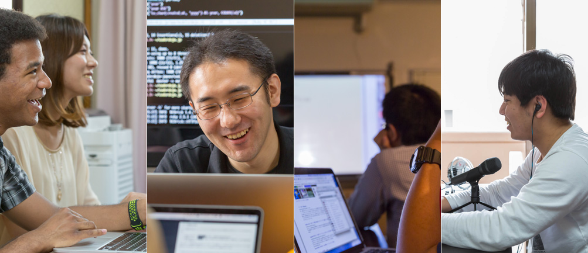

<section class="pageVisual">
  

  

</section>
<section class="entry_content pt-5">
  

    

      

        

          <h1 class="text-center mb-5">弊社をご検討されている皆さんへ</h1>
        

        
      
<!--//col12-->
    
<!--//row-->
    
    
 
      

        
次のような方々に向けて社内の情報をまとめています。

        <ul>
          <li>現在転職/就職活動中、インターン先・複業先を探している</li>
          <li>YassLab 社での働き方やプロダクトに興味・関心がある</li>
          <li>YassLab 社を通して、OSSコミュニティに貢献したい</li>
        </ul>
      
<!--//col-->
    
<!--//row-->

  
<!--//container-->
</section>

<section class="entry_content pt-5 bg-gray">
  

    

      

        <h2 id="services" class="mt-5 mb-5"><a href="#services">YassLab 社のカタチ</a></h2>
	
        
(これまでの事業実績は<a href="/ja/works/">コチラ</a>をご参照ください)

      
<!--//col-->
    
<!--//row-->
  
<!--//container-->
</section>

<section class="entry_content pt-5">
  

    

      

        <h2 id="support" class="mt-5 mb-5">月額制の Ruby/Rails 開発支援</h2>
        
弊社の主力事業の1つです。他社の新規事業の開発をサポートするため、他社の秘密情報にアクセスする必要があり、パートタイムの方や複業の方が関わることはありません。また、フルタイム勤務者以外は他社の秘密情報にアクセスできない仕組みが用意されているため、アクセスできる情報が読んでも問題ない情報となり、競業避止義務などを気にせず安心して働くことができます。開発支援事業の詳細は<a href="/ja/agile/">コチラ</a>を参照してください。

      
<!--//col-->
      
      

        

        
参考: <a href="https://speakerdeck.com/yasulab/qiita-team-extensions-for-parallel-working?slide=11">Qiita:Team Extensions for Parallel Working - Speaker Deck</a>

      
<!--//col-->
      
お互いの働き方や価値観を知るためにも、フルタイム勤務を希望される方であってもまずは下記の自社プロダクトを一緒に開発してみるところから始めることが多いです。もし興味があれば仕事として一緒にやってみませんか?

    
<!--//row-->
  
<!--//container-->
</section>

<section class="entry_content pt-5">
  

    

      

	<h2 id="products"><a href="#products">自社プロダクトまとめ</a></h2>
	

<pre class="highlight"><code>- 開発目的: そのプロダクトで実現したいこと
- 使用技術: 開発で使われているテクノロジー
- 関連情報: 参考になる公開情報など</code></pre>

	<h3 id="railstutorial" class="text-center mt-5 mb-5">1. Railsチュートリアルの自動更新</h3>
	<ul>
	  <li>開発目的: <a href="https://railstutorial.jp/">Railsチュートリアル</a>の品質を保ちつつ、なるべく低コストで更新したい</li>
	  <li>使用技術: Ruby, Rails, LaTeX, <a href="https://github.com/softcover/softcover">softcover</a>, Heroku</li>
	  <li>関連情報:
	    <ul>
	      <li>yasslab/railstutorial.jp_web (Private)</li>
	      <li>yasslab/ruby_on_rails_tutorial_book (Private)</li>
	      <li>スライド: <a href="https://speakerdeck.com/yasulab/continuous-integration-for-ebook">Railsチュートリアルを支える継続的組版技術</a></li>
	    </ul>
	  </li>
	</ul>

	<h3 id="railsguides" class="text-center mt-5 mb-5">2. Railsガイドの自動更新</h3>
	<ul>
	  <li>開発目的: <a href="https://railsguides.jp/">Railsガイド</a>の品質を保ちつつ、なるべく低コストで更新したい</li>
	  <li>使用技術: Ruby, Rails, Jekyll, <a href="https://github.com/kmuto/review">Re:VIEW</a>, Heroku</li>
	  <li>関連情報:
	    <ul>
	      <li><a href="https://github.com/yasslab/railsguides.jp">yasslab/railsguides.jp</a> (OSS)</li>
	      <li>yasslab/railsguides.jp_ebook (Private)</li>
	      <li>スライド: <a href="https://speakerdeck.com/yasulab/railsguides-as-an-oss-gate">OSS入門としてのRailsガイド</a></li>
	    </ul>
	  </li>
	</ul>

	<h3 id="coderdojo-japan" class="text-center mt-5 mb-5">3. CoderDojo Japan の開発</h3>
	<ul>
	  <li>開発目的: 全国の <a href="https://coderdojo.jp/">CoderDojo コミュニティ</a>の活動をテクノロジーで支援したい</li>
	  <li>使用技術: Ruby, Rails, DB設計, <a href="https://scrivito.com/">Scrivito</a> (Rails CMS), Haml, Heroku</li>
	  <li>関連情報:
	    <ul>
	      <li><a href="https://github.com/coderdojo-japan/coderdojo.jp">coderdojo-japan/coderdojo.jp</a> (OSS)</li>
	      <li><a href="https://github.com/coderdojo-japan/dojopaas">coderdojo-japan/dojopaas</a> (OSS)</li>
	      <li>スライド: <a href="https://speakerdeck.com/yasulab/case-study-rails-cms-for-coderdojo">CoderDojo を支える Rails CMS の活用事例</a>
		  </li>
	    </ul>
	  </li>
	</ul>

	<h2 id="flow" class="text-center mt-5 mb-5">応募から採用までの流れ</h2>
	
会社について詳しく知ってもらったり、あるいは会社側がその人を詳しく知るためには、一緒に何かをやってみるのが早いと考えています。そこで YassLab 社では、まずは弊社が携わっている OSS で一緒に開発するスタイルを採用しています。

	

	
OSSリポジトリ上でチーム開発する例 (<a href="https://github.com/coderdojo-japan/coderdojo.jp/pull/287">詳細</a>)

	
例えば2018年2月21日にパートタイムで入社した <a href="https://twitter.com/AnaTofuZ">@AnaTofuZ</a> さんの場合、まずは CoderDojo Japan の開発を１ヶ月ほど一緒に進めてみて、その後、契約を更新するかどうか判断するというステップを踏みました。

	<ul>
	  <li><a href="https://github.com/coderdojo-japan/coderdojo.jp/pull/261">@AnaTofuZ さんの最初のPR</a></li>
	  <li><a href="https://github.com/coderdojo-japan/coderdojo.jp/pull/287">１ヶ月ほど経ち、チーム開発に慣れてきたPR</a></li>
	  <li><a href="https://github.com/coderdojo-japan/coderdojo.jp/pulls?q=is%3Apr+author%3AAnaTofuZ+created%3A%3E2018-02-21+sort%3Acreated-asc">他、当該OSSリポジトリ上で行われた各種PRの一覧</a></li>
	</ul>

	
弊社は完全リモートワーク制で開発を進めていることもあり、実際に体験してみないと伝えきれない雰囲気も多いです。一緒に何かを進める過程でそれぞれの長所/短所を知り、その上で継続するのであれば、お互いに納得感を持って働くことにも繋がると思います。

	
もちろん結果として契約の更新に繋がらない場合もありますが、その場合であっても期間中の給与は会社から支払われます。また、なるべく OSS のプロジェクトを題材にしているので、その後の就職/転職活動で OSS に貢献した実績を活かすこともできます。

	
題材としては Ruby on Rails アプリケーションである <a href="#coderdojo-japan">CoderDojo Japan の開発</a> が特に人気ですが、それ以外にも多様な OSS プロダクトを GitHub 上から公開しております。他のプロダクトについては <a href="https://github.com/yasslab">GitHub から公開しているリポジトリ</a>をご参照ください ;)  

	
	<!--
	     ### 1. Gitlate - 継続的翻訳システム
	     
	   - 開発目的: 大型書籍や巨大ドキュメントの翻訳を自動化する
	   - 使用技術: Ruby, Rails, Vuejs, Gitメカニズム, アルゴリズム (Jaro-Winklerなど), Gengo API, Google Cloud Computing (Translate API), Engine Yard
	   - 関連情報:
	   - スライド: [How We Continuously Translate Tech Docs](https://speakerdeck.com/yasulab/how-we-continuously-translate-tech-docs)
	   - yasslab/gitlate (Private)
	     
	     ### 5. YassLab Website
	     
	   - 開発目的: 会社情報や実績紹介を分かりやすく掲載する (日英対応)
	   - 使用技術: Ruby, Jekyll, Web Design, GitHub Pages
	   - 関連情報: 
	   - [https://yasslab.jp/](https://yasslab.jp/)
	   - [yasslab/yasslab.jp](https://github.com/yasslab/yasslab.jp) (OSS)
	-->
	
	<h2 id="references" class="text-center mt-5 mb-5"><a href="#references">他、参考情報</a></h2>

	<ul>
	  <li>会社名: {{ site.company.name }} 株式会社</li>
	  <li>社員数: {{ site.company.size }}名 (パート・複業採用含む)</li>
	  <li>資本金: {{ site.company.capital }}万円</li>
	  <li>創業日: 2012年6月1日 (2018年1月11日 法人成り)</li>
	  <li>代表取締役: 安川 要平</li>
	  <li>福利厚生など:
	    <ul>
	      <li>労働保険、雇用保険、社会保険、昇給あり (パートタイムの場合、条件による)</li>
	      <li>完全週休２日制、夏季休暇、冬季休暇、有給休暇、慶弔休暇、育児介護休暇あり</li>
	      <li>詳細は<a href="https://www.dropbox.com/s/izpn94kvm13807g/%E3%82%B5%E3%83%B3%E3%83%97%E3%83%AB_%E9%9B%87%E7%94%A8%E5%A5%91%E7%B4%84_%E3%83%95%E3%83%AB%E3%82%BF%E3%82%A4%E3%83%A0.pdf?dl=0">雇用契約書</a> (<a href="https://www.dropbox.com/s/tdwntl4qn0tmm18/%E3%82%B5%E3%83%B3%E3%83%97%E3%83%AB_NDA_%E9%9B%87%E7%94%A8.pdf?dl=0">NDA</a>、<a href="https://www.dropbox.com/s/i75g4mi4oulo19g/%E3%82%B5%E3%83%B3%E3%83%97%E3%83%AB_%E9%9B%87%E7%94%A8%E5%A5%91%E7%B4%84_%E7%9F%AD%E6%99%82%E9%96%93%E5%8B%A4%E5%8B%99.pdf?dl=0">学生向け</a>) / <a href="https://www.dropbox.com/s/rdz75lqwt3bsw1y/%E3%82%B5%E3%83%B3%E3%83%97%E3%83%AB_%E6%A5%AD%E5%8B%99%E5%A7%94%E8%A8%97_%E5%9F%BA%E6%9C%AC%E5%A5%91%E7%B4%84%E6%9B%B8.pdf?dl=0">業務委託契約書</a> (<a href="https://www.dropbox.com/s/puh54vxf2pf4rg1/%E3%82%B5%E3%83%B3%E3%83%97%E3%83%AB_NDA_%E6%A5%AD%E5%8B%99.pdf?dl=0">NDA</a>) / <a href="https://www.dropbox.com/s/15z9ks4oeyyyf6k/YassLab%20%E5%B0%B1%E6%A5%AD%E8%A6%8F%E5%89%87.pdf?dl=0">就業規則</a>・<a href="https://www.dropbox.com/s/z8j7zgjtc7a8rnp/YassLab%20%E8%B3%83%E9%87%91%E8%A6%8F%E5%AE%9A.pdf?dl=0">賃金規定</a>をご参照ください</li>
	    </ul>
	  </li>
	  <li>顧問社労士: <a href="http://oka-sr.jp/">社会保険労務士法人 岡佳伸事務所</a> 岡 佳伸</li>
	  <li>顧問税理士: <a href="http://www.hay-kaikei.com/">Hay未来の税理士法人</a> 林 寛之</li>
	  <li>顧問弁護士: <a href="http://nojimarie.naganoblog.jp/">新都心法律事務所</a> 野島 梨恵</li>
	  <li>パートナー・関連団体:
	    <ul>
	      <li><a href="http://www.boss-con.jp/railspartner/">BOSS-CON JAPAN</a> (Rails認定ゴールドインテグレーター)</li>
	      <li><a href="http://www.railscp.com/aboutus/">Rails技術者認定試験運営委員会</a> (テクニカルアドバイザー)</li>
	      <li><a href="https://oss-gate.github.io/">OSS Gate</a> (<a href="https://yasslab.jp/ja/doorkeeper/">Doorkeeper スポンサー</a>)</li>
	      <li><a href="http://www.ryukyu-frogs.com/">Ryukyufrogs</a> (テクニカルサポーター、協賛)</li>
	      <li><a href="http://ruby-no-kai.org/">日本Rubyの会</a> (<a href="https://bugs.ruby-lang.org/projects/ruby/wiki/Contributions">CIサーバー</a>提供、<a href="http://rubykaigi.org/">RubyKaigi</a>翻訳協力)</li>
	      <li><a href="https://scrivito.com/partners">Scrivito</a> (開発パートナー)</li>
	      <li><a href="https://coderdojo.jp/">CoderDojo Japan</a> (開発支援)</li>
	      <li><a href="http://www.mitou.org/">Mitou Foundation</a> (<a href="http://jr.mitou.org/">未踏ジュニア</a>PM・スポンサー)</li>
	    </ul>
	  </li>
	  <li>SNS: 
	    <a href="https://github.com/yasslab">GitHub</a> (<a href="https://github.com/search?utf8=%E2%9C%93&amp;q=user%3Ayasslab+fork%3Atrue&amp;type=Repositories&amp;ref=searchresults">人気順</a>), 
	    <a href="http://qiita.com/organizations/yasslab">Qiita</a>, 
	    <a href="https://www.facebook.com/yasslab.jp">Facebook</a>, 
	    <a href="https://twitter.com/YassLab">Twitter</a>, 
	    <a href="https://www.youtube.com/c/YassLab">YouTube</a>, 
	    <a href="https://www.wantedly.com/companies/YassLab">Wantedly</a>.</li>
	</ul>
        
      
<!--//col-->
    
<!--//row-->
  
<!--//container-->

</section>
